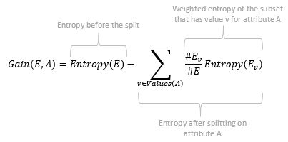
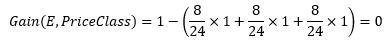

# DecisionTree-Java-Implementation
An intuitive Java implementation (built from the very bottom) for a Decision Tree classifier, based on the "Titanic - Machine Learning from Disaster" dataset [[1]](#references).

The classifier achieves an accuracy of **0.8227 with a 10-fold cross-validation** and an accuracy of **0.7249 with the Kaggle test data set**.

## Algorithm
The implementation is based on the **C4.5 algorithm** developed by Ross Quinlan [[2]](#references). Pseudocode and a detailed explanation of its main concepts is provided in the following sections.
1. [Pseudocode](#pseudocode)
2. [C4.5 Explanation](#detailed-explanation)   
  2.1 [Entropy](#entropy)  
  2.2 [Information gain](#information-gain)  

### Pseudocode
```
train(EXAMPLES, TARGET_ATTRIBUTE, ATTRIBUTES)
   if all EXAMPLES positiv
     return root (label = +)
   else if all EXAMPLES negative
     return root (label = -)
   else if ATTRIBUTES is empty
     return root (label = mcv(TARGET_ATTRIBUTE)) //mcv = most common value
   else
     A <- the attribute of ATTRIBUTES that best classifies EXAMPLES
     A is attribute for ROOT
     For each value v in A
       create new child c_v for ROOT
       create subset EXAMPLES_v for c_v
       if EXAMPLES_v is empty
         create leaf (label = mcv(TARGET_ATTRIBUTE))
       else
         train(EXAMPLES_v, TARGET_ATTRIBUTE, ATTRIBUTES - {A})
```
The recursive algorithm generates a decision tree from a set of training data using the concept of (information) entropy. At each node of the tree, C4.5 chooses the attribute of the data that most effectively splits the training data into subsets. To find that "best attribute", the information gain (related to entropy but not the same) for each attribute is calculated and the one with the highest gain is chosen. The algorithm then recurses on the partitioned data subsets.

### Detailed explanation
The aim of the algorithm is to train a classifier with as little effort as possible and at the same time as few errors as possible. We can do this by excluding large parts of the search area or classifying large parts of the data set as quickly as possible. In the following example, the two attributes Sex and PriceClass would be differently well suited.
<br/>
If splitting on the gender attribute, the 24 data points would be distributed to the two classes male and female. The resulting subsets are homogeneous with regard to the target attribute (survived), which means that we don't have to train the tree any further. We can make the best possible decision here based on the training data, namely: male passengers are classified as `survived`, female passengers as `not survived`.
If splitting on PriceClass, the decisions are not that simple. The 8 passengers in price class 1 are divided into 4 survivors and 4 non-survivors. When trying to classify a new passenger of price class 1, we could only guess the label, which is why the impure subsets have to be split up on the basis of further attributes (if there are more). The same applies to the subsets with price class 2 and price class 3.<br/>
**In a nutshell: The optimal case when training our tree would be to obtain completely pure / homogeneous subsets when dividing them based on an attribute (here: the gender), the worst case would be completely impure / heterogeneous subsets (here: the PriceClass).**


#### Entropy
A metric to measure the uncertainty of a class in a subset of examples is entropy [[3]](#references).<br/>
<br/>
It can be interpreted as the average number of decisions (bits) needed to distinguish the positive (survived) from the negative (not survived) examples.<br/>
The following applies to our pure subsets:<br/>
<br/>
And for our completely impure subsets:<br/>
<br/>
The course of the entropy for two possible events is also nicely illustrated in the following graphic:<br/>
<br/>

**The more certain we are in our decision, the lower the entropy. This also means that an attribute is the better the more the entropy can be reduced and the higher the `gained information`.**

#### Information gain
Entropy is only a measure of how pure a subset of an attribute is. But since several subsets arise when splitting an attribute, we have to combine the individual entropies into one value in order to be able to make an overall statement about how good the split is. The keyword here is `information gain`.<br/>
<br/>

Information gain is nothing other than the difference in entropy before and after the split at a certain attribute. The entropy that would result from the split is additionally weighted so that subsets with more data also have more weight.<br/>
The following applies to our two examples:<br/>
<br/>
<br/>

The value for the information gain is between 0 and 1. The higher the value, the more certainty there is in our decision on the classification. The best attribute is therefore the one with the highest information gain.
<br/>
<br/>

For a more detailed (and visualized) explanation I highly recommend watching the youtube playlist from Victor Lavrenko [[4]](#references).

## References
[1] https://www.kaggle.com/c/titanic<br/>
[2] https://www.rulequest.com/Personal/<br/>
[3] https://en.wikipedia.org/wiki/Entropy_(information_theory)<br/>
[4] https://www.youtube.com/playlist?list=PLBv09BD7ez_4temBw7vLA19p3tdQH6FYO<br/>
